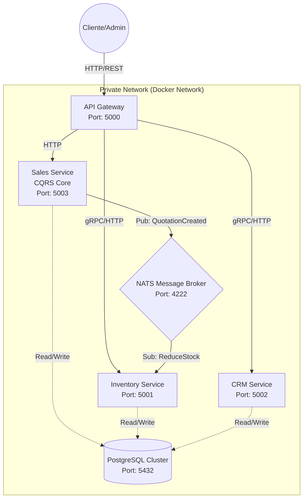
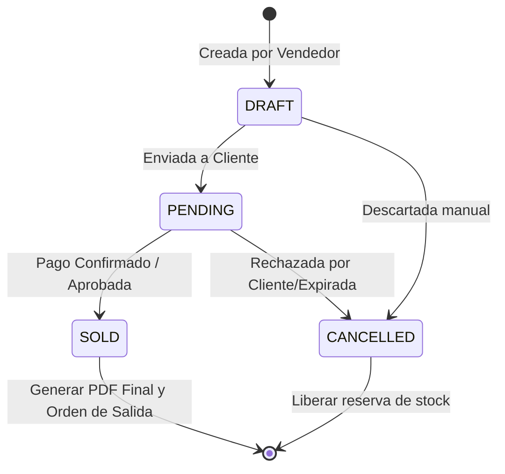

# Project Design Reference (PDR)

**Versión:** 1.0.0
**Estado:** Aprobado para Desarrollo
**Dominio:** Retail / Ferretería
**Arquitectura:** Microservicios Event-Driven (Cloud Agnostic)

---

## 1. Resumen Ejecutivo

El proyecto "Shama Core" tiene como objetivo desarrollar un sistema de gestión de ventas modular para **Ferretería Shama**. La prioridad arquitectónica es la portabilidad extrema: el sistema debe ser capaz de desplegarse idénticamente en un entorno *on-premise* (Homelab/Raspberry Pi), un VPS de bajo costo (DigitalOcean, Linode) o una nube pública (AWS/GCP) sin refactorización de código.

El sistema implementará patrones de alta disponibilidad y desacoplamiento mediante **Microservicios**, **CQRS** (Command Query Responsibility Segregation) y una estrategia de **Observabilidad Ligera**.

---

## 2. Arquitectura del Sistema

### 2.1 Principios de Diseño

1. **Zero Vendor Lock-in:** No se utilizarán servicios gestionados propietarios (ej. AWS SQS, Azure SQL). Toda la infraestructura se basará en contenedores Docker estándar.
2. **Comunicación Asíncrona:** El desacoplamiento entre servicios se gestionará mediante un bus de eventos ligero (NATS).
3. **Segregación de Puertos:** Para evitar conflictos en entornos de red compartidos (Host Networking), se utilizará el rango de puertos **5000-5099**.

### 2.2 Diagrama de Contexto y Puertos



---

## 3. Especificación de Microservicios

### 3.1 API Gateway (`shama-gateway`)

* **Puerto:** `5000` (Expuesto públicamente)
* **Responsabilidad:** Punto de entrada único, terminación SSL (si aplica), *Rate Limiting*, y enrutamiento hacia los microservicios internos.
* **Tecnología:** NestJS + Fastify (High Performance).

### 3.2 Inventory Service (`shama-inventory`)

* **Puerto:** `5001`
* **Bounded Context:** Catálogo y Stock.
* **Funcionalidades:**
* CRUD de Productos (SKU, Nombre, Precio Unitario).
* Gestión de Stock (Incrementar/Decrementar).
* **Optimización:** Caché en memoria (Redis opcional) para lectura de precios.


### 3.3 CRM Service (`shama-crm`)

* **Puerto:** `5002`
* **Bounded Context:** Gestión de Relaciones con Clientes.
* **Funcionalidades:**
* Registro de clientes (Nombre, NIT/RUC, Dirección, Email).
* Historial de compras (Proyección de datos desde Sales).


### 3.4 Sales Service (`shama-sales`) - **CORE**

* **Puerto:** `5003`
* **Patrón Arquitectónico:** CQRS (Command Query Responsibility Segregation).
* **Responsabilidad:** Gestión del ciclo de vida de la cotización y facturación.
* **Base de Datos:** PostgreSQL (Schema: `sales_db`).

#### Implementación de CQRS en Sales Service:

| Componente | Descripción Técnica |
| --- | --- |
| **Write Side (Commands)** | Maneja la lógica de negocio y transacciones. <br>

<br>Ej: `CreateQuotationCommand`, `ApproveQuotationCommand`. Valida reglas de negocio estrictas. |
| **Read Side (Queries)** | Optimizado para lectura rápida. <br>

<br>Ej: `GetQuotationSummaryQuery`. Utiliza proyecciones SQL directas evitando el overhead de ORM en listados masivos. |
| **Event Bus** | Emite eventos de dominio: `Quotation.Created`, `Quotation.Sold`, `Quotation.Cancelled`. |

---

## 4. Máquina de Estados (Cotizaciones)

El recurso `Quotation` se rige por una máquina de estados finita para garantizar la integridad de los datos financieros.



* **DRAFT (Borrador):** Permite edición libre de items. No reserva stock físico, solo verifica disponibilidad teórica.
* **PENDING (Pendiente):** La cotización es inmutable. Se envía al cliente.
* **SOLD (Vendida):** Transacción finalizada. **Snapshot de precios:** En este estado, los precios de los items se guardan como JSONB estático para que cambios futuros en el catálogo no afecten el historial contable.
* **CANCELLED (Cancelada):** Estado terminal sin efecto.

---

## 5. Módulo de Reportes (PDF Engine)

El servicio `shama-sales` incluirá un sub-módulo de generación de documentos.

* **Motor:** `pdfmake` (Server-side). Elegido por su bajo consumo de CPU comparado con motores basados en Headless Chrome.
* **Identidad Corporativa:**
* **Color Primario (Header/Acentos):** `#f0c800` (Amarillo Industrial).
* **Color Secundario (Texto/Bordes):** `#2E2725` (Dark Charcoal).


* **Formato de Salida:** Buffer de datos binarios servido vía Stream HTTP para descarga inmediata.

---

## 6. Stack Tecnológico & Infraestructura (Cloud Agnostic)

Este stack garantiza que el sistema pueda correr en cualquier VPS Linux estándar o Hardware ARM (Raspberry Pi).

### 6.1 Base de Datos

* **Motor:** PostgreSQL 15.
* **Estrategia:** Instancia única de contenedor, múltiples bases de datos lógicas (`db_inventory`, `db_crm`, `db_sales`) para mantener el aislamiento lógico de los microservicios sin el costo de múltiples instancias de DB.

### 6.2 Observabilidad (Lightweight Stack)

Para evitar el consumo excesivo de recursos de soluciones como ELK, se utilizará el stack **PLG**:

1. **Promtail:** Recolección de logs de contenedores.
2. **Loki:** Agregación de logs ligera.
3. **Grafana:** Visualización unificada.
4. **OpenTelemetry:** Instrumentación automática de NestJS para trazas distribuidas.

### 6.3 Definición de Despliegue (Docker Compose)

El siguiente manifiesto es la fuente de la verdad para el despliegue.

```yaml
networks:
  shama-net:
    driver: bridge

services:
  # --- Message Broker ---
  nats:
    image: nats:2.9-alpine
    container_name: shama-nats
    ports:
      - "4222:4222"
    networks:
      - shama-net

  # --- Database ---
  postgres:
    image: postgres:15-alpine
    container_name: shama-db
    environment:
      POSTGRES_USER: shama_user
      POSTGRES_PASSWORD: secure_password
    volumes:
      - pg_data:/var/lib/postgresql/data
    networks:
      - shama-net
    healthcheck:
      test: ["CMD-SHELL", "pg_isready -U shama_user"]
      interval: 5s
      timeout: 5s
      retries: 5

  # --- Microservicios ---
  inventory-svc:
    build: ./apps/inventory
    container_name: shama-inventory
    ports:
      - "5001:5001"
    environment:
      - PORT=5001
      - DB_HOST=postgres
      - NATS_URL=nats://nats:4222
    depends_on:
      postgres:
        condition: service_healthy
    networks:
      - shama-net

  crm-svc:
    build: ./apps/crm
    container_name: shama-crm
    ports:
      - "5002:5002"
    environment:
      - PORT=5002
      - DB_HOST=postgres
    depends_on:
      postgres:
        condition: service_healthy
    networks:
      - shama-net

  sales-svc:
    build: ./apps/sales
    container_name: shama-sales
    ports:
      - "5003:5003"
    environment:
      - PORT=5003
      - DB_HOST=postgres
      - NATS_URL=nats://nats:4222
      - BRAND_COLOR_PRIMARY=#f0c800
      - BRAND_COLOR_SECONDARY=#2E2725
    depends_on:
      postgres:
        condition: service_healthy
    networks:
      - shama-net

  gateway:
    build: ./apps/gateway
    container_name: shama-gateway
    ports:
      - "5000:5000"
    environment:
      - INVENTORY_URL=http://inventory-svc:5001
      - CRM_URL=http://crm-svc:5002
      - SALES_URL=http://sales-svc:5003
    networks:
      - shama-net

volumes:
  pg_data:

```

---